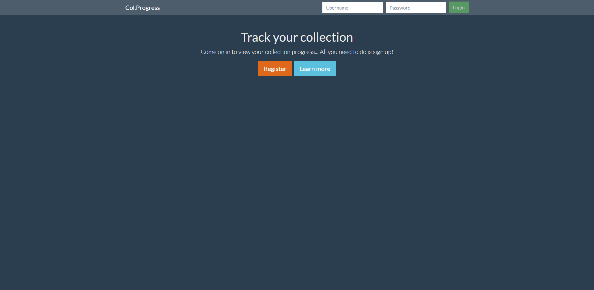
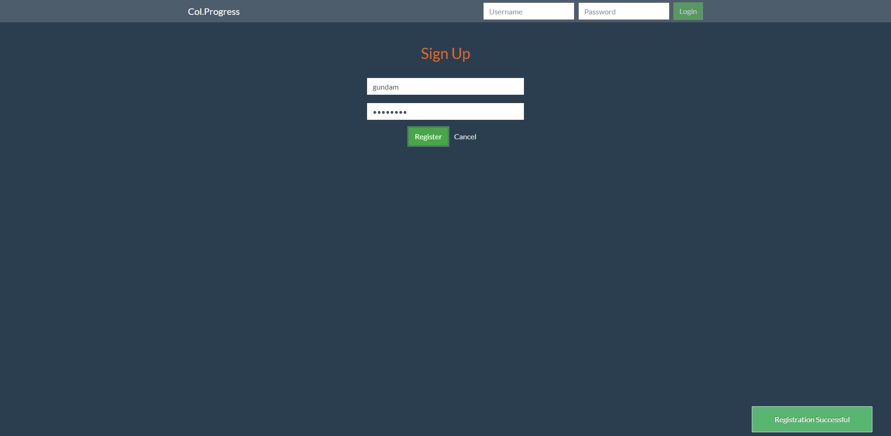
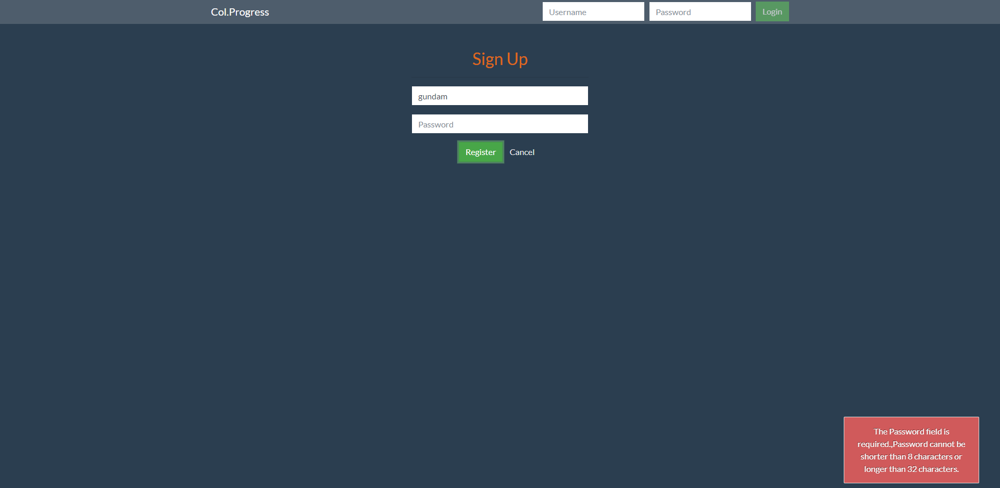
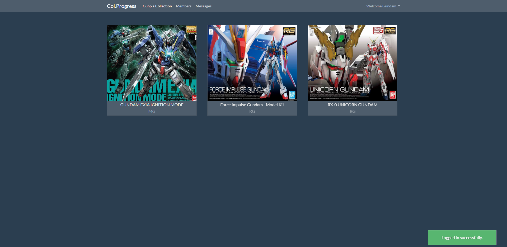
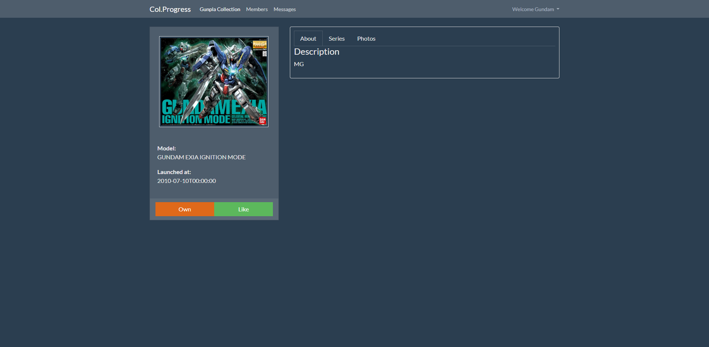
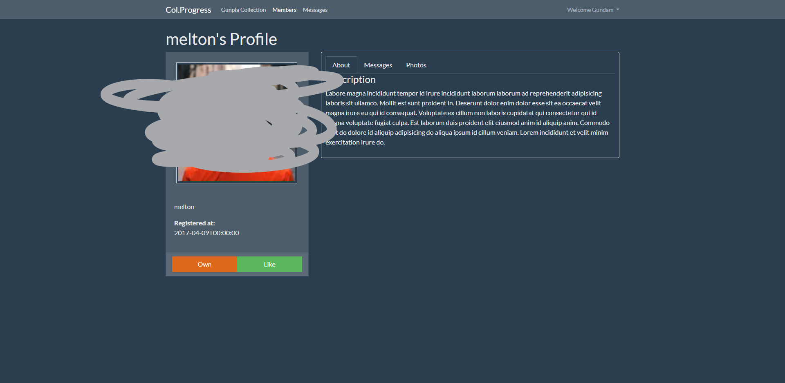
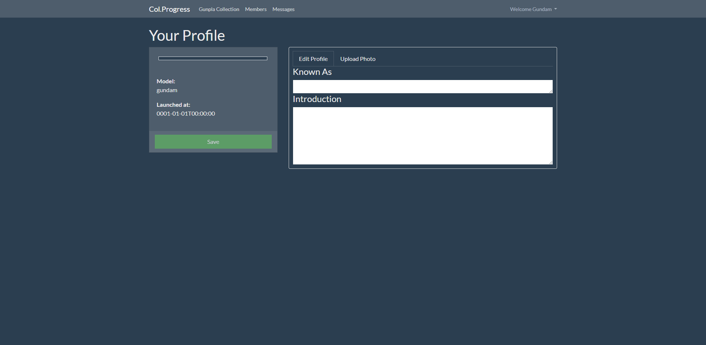

# Collection App

Getting a full collection of things is satisfying, but it could be tedious in the progress.

*This platform aims to help you track your collection progress*

**Currently this project works as a testing field for the concept using [Gunpla](https://en.wikipedia.org/wiki/Gundam_model) as the target.**

- [Why](#why)
- [Function showcase](#function-showcase)
- [What have I done so far?](#what-have-i-done-so-far)
- [Going down the line](#going-down-the-line)
- [Appendix](#appendix)

## Why?

This is a practice project for me to get used to dotnet development for the most part. 

I spent days to think of a great project idea, being influnced heavily by the collection concept in video games, I decided to build a real life collection app.

This is my testing field, hone my skills will be the major target!!!

~~Also I learnt this idea was implemented years ago by gunpla fans.~~

## Function showcase

## What have I done so far?

I have already get the api up and running.

Starting off of the server

- [x] It implements the **Repository pattern** for app-db data transmission.

- [x] **Data Transmission Object(DTO)** is used for data accessing from its client.

- [x] It uses **AutoMapper** to handle model to dto mapping (vice versa).

- [x] SQLite is used for the development, this is due to change when bring it into production mode.

- [x] JWT is the choice of authentication token.

- [x] Custom Exception Handler is in place

Going towards the client side:

- [x] Angular is the framework of choice, it's a single page application.

- [x] Multiple **services to reduce redudant coding**.

- [x] Guards are implemented to avoid unauthorized access and unintended redirection.

- [x] Resolvers are used to achieve real time data object access.

## Going down the line

1. Refine this project and learn to deploy it into production mode.

2. Get going with Jenkins and Docker! They're both interesting in terms of improving productivities.

3. Learn TDD with .Net

4. **React** is the next framework to learn, as I really just need the front-end framework be purely for UI.

5. **Swift** will be the last stop in recent development training, I'll be implementing a version of this idea in iOS form one day.

## Appendix

*Welcome Page*

*Register Can Succeed*

*Register Can Report Failure*

*Login bring user to model listing*

*User can view model detail*

![User listing[(./demo/user-listing.png)
*User can see other users in a ranking style (Function currently under development)*

*Users can see other user's profile*

*Users can edit their profile*
